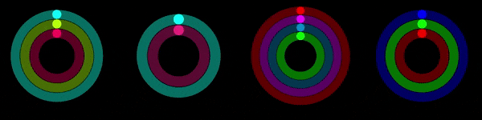

# react-activity-rings
**Apple-inspired Activity Rings for React.**  


## Examples
```tsx
<ActivityRings rings={[
  {filledPercentage: 0.5, color: '#fa0e5a'},
  {filledPercentage: 0.75, color: '#afff02'},
  {filledPercentage: 0.25, color: '#00fff8'},
]} />
```
```tsx
<ActivityRings 
  rings={[
    {filledPercentage: 0.1, color: 'rgb(255, 0, 0)'},
    {filledPercentage: 1, color: '#FF0000'},
    {filledPercentage: 0.5, color: '#00fff8'},
  ]} 
  options={{
    initialRadius: 20,
    animationDurationMillis: 1500,
    containerHeight: '10vh',
  }} 
/>
```

## API
### ActivityRings
#### Props
* **rings:** Array of the interface ActivityRing, **required**
* **options:** An object of type ActivityRingContainerOptions

### ActivityRing
#### Fields
* **filledPercentage:** A float between 0 and 1 representing the progress in percent, **required**
* **color:** A css-compatible color string i.e. `#FF00FF` or `rgb(0, 255, 0)`, **required**

### ActivityRingContainerOptions
#### Fields
* **containerHeight:** A css-compatible height of the container, default=`100%`
* **containerWidth:** A css-compatible width of the container, default=`100%`
* **paddingBetweenRings:** The padding between the single rings, default=`0.75`
* **initialRadius:** The radius of the innermost ring, default=`30`
* **animationDurationMillis:** The duration of the initial animation in milliseconds, default=`1000`

## License
The project is licensed under the MIT license.    
Check the [LICENSE](./LICENSE) file, for the full legal-notice.
